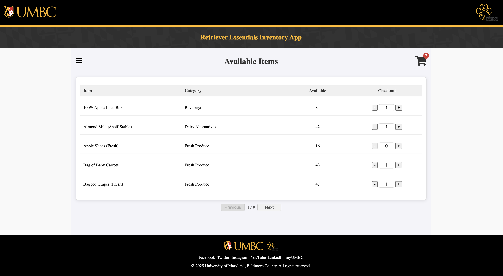

# Retriever Essentials Inventory App

The Retriever Essentials Inventory App is a full-stack inventory management system designed to streamline food distribution for students at the University of Maryland, Baltimore County (UMBC). The app provides a comprehensive solution to manage inventory, process online orders, and log transactions, offering a seamless experience for both students and administrators. Students can securely browse available items, add them to a cart, and place orders with optional notes, while administrators can efficiently manage inventory, monitor orders, and track transactions. Beyond these core features, the app supports real-time restock alerts, detailed order histories, and role-based access control, ensuring that both users and admins can interact with the system in a secure and efficient manner. With its intuitive interface and robust backend, the Retriever Essentials Inventory App enhances the food distribution process, making it easier to manage and scale UMBC’s food assistance efforts, while providing valuable insights and automated features to improve the overall experience.

## Features

#### Student Functionality
- **Secure Login**: Authenticate via UMBC Google accounts
- **Item Browsing**: View available inventory items
- **Cart Management**: Add items to the cart before placing an order
- **Order History**: View past orders and their details

#### Administrator Functionality
- **Secure Login**: Authenticate via UMBC Google accounts
- **Item Browsing**: View available inventory items
- **Cart Management**: Add items to the cart before placing an order
- **Order History**: View past orders and their details
- **Inventory Management**: Add, update, and delete items
- **User Management**: Assign roles and manage user data
- **Transaction Report**: Monitor users orders

## Technology Stack

#### Frontend
- **React**: Single Page Application for the UI
- **React Router**: Client-side routing between views
- **Axios**: API request handling
- **Context API**: Global state management for authentication and cart
- **Plain CSS**: Plain CSS for responsive design

#### Backend
- **FastAPI**: High-performance web framework for API development
- **Python 3.10+**
- **SQLAlchemy**: ORM for database interaction
- **Pydantic**: Data validation and serialization

#### Database
- **MariaDB (via AWS RDS)**: Persistent storage for users, items, orders, and transactions

#### Authentication
- **Firebase Authentication**: Google Sign-In restricted to `umbc.edu` email addresses

#### Hosting (Planned)
- **Frontend**: Firebase Hosting  
- **Backend**: Virtual Machine or containerized deployment (e.g., AWS EC2, GCP)

## Installation & Setup

#### Requirements
- Node.js & npm  
- Python 3.10+  
- MySQL or MariaDB  
- Firebase Project with Auth enabled  

## System Architecture

The application follows a **client-server architecture** with clean separation of concerns:

- **Frontend (React):** Handles UI, routing, and user interactions  
- **Backend (FastAPI):** Manages REST API logic, validation, and database interactions  
- **Database (MariaDB):** Stores persistent data including users, orders, items, and transactions  

This architecture supports:
- Clean separation of concerns
- Modular and maintainable codebase
- Secure and scalable with role-based access control
- Secure routing and protected resources  

## Project Structure

#### Frontend (React)
- `App.js` – Top-level routing  
- `AuthContext.js` – Manages login session and role  
- `CartContext.js` – Tracks current cart state  
- `StudentDashboard/` – Student views: Items, Cart, Past Orders  
- `AdminDashboard/` – Admin views: Items, Users, Orders, Transactions  

#### Backend (FastAPI)
- `main.py` – Application entrypoint  
- `routes/` – Handles endpoints (`auth.py`, `items.py`, `orders.py`, etc.)  
- `models/` – SQLAlchemy ORM models (`User`, `Item`, `Order`, etc.)  
- `schemas/` – Pydantic models for validation  

#### Security

- Google Sign-In via Firebase restricts access to UMBC email accounts  
- Firebase ID tokens are verified server-side for every request  
- Protected routes based on user roles (student/admin)  

#### Project Management
- **Version Control:** GitHub  
- **Task Management:** Jira  
- **Branching Strategy:**  
  - `main` branch holds the latest stable release  
  - Feature branches created for specific Jira tasks  
  - Pull requests require team review before merging  

#### Project Demo
