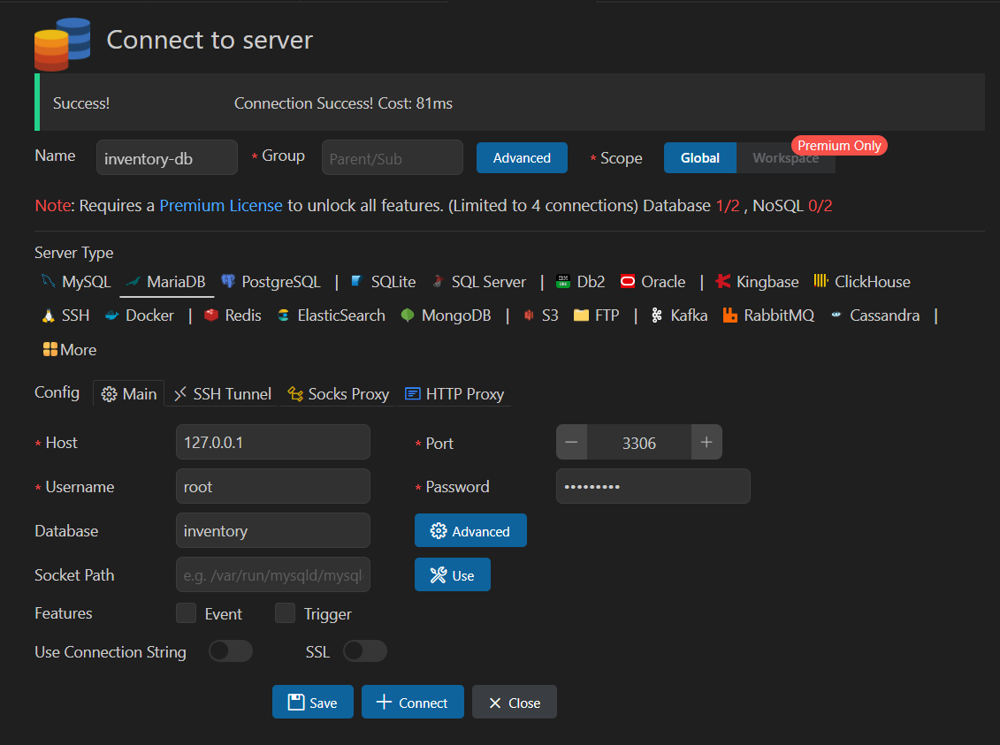
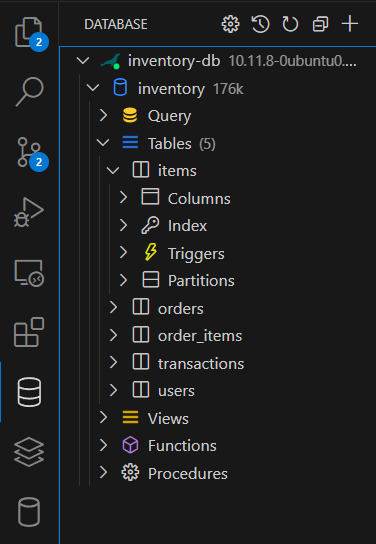

# MariaDB Setup Guide

This project uses **MariaDB** for database management.  
Each developer runs **their own local instance** of MariaDB, meaning:
- Everyone installs MariaDB on their own machine.
- The database schema (`schema.sql`) must be applied manually.
- each developer is responsible for maintaining their local database.
- Example test data can be loaded using `example.sql` (TBD)

---

## **1️. Installing MariaDB**
### **Ubuntu / WSL**
```sh
sudo apt update
sudo apt install mariadb-server mariadb-client -y
```

### **MacOS (Homebrew)**
(Please update MacOS instructions if needed)
```sh
brew install mariadb
brew services start mariadb
```

## **2. Starting and stopping the database**
### **Start Mariadb:**
```sh
sudo service mariadb start
```
### **check if running:**
```sh
sudo service mariadb status
```

## **3. Setting up the `inventory` database**
Each developer must create the database **locally**.
### **1. Open mariadb:**
```sh
mysql -u root -p
```
(Enter your MariaDB root password)
Output should show something like: 
```sh
MariaDB [(none)]>
```

### **2. Create `inventory` database:**
```sh
CREATE DATABASE inventory;
SHOW DATABASES;
EXIT;
```
You should see the database in your list something like this:
```sh
MariaDB [(none)]> SHOW DATABASES;
+--------------------+
| Database           |
+--------------------+
| information_schema |
| inventory          |
| mysql              |
| performance_schema |
| sys                |
+--------------------+
5 rows in set (0.001 sec)
```

## **4. Connect MariaDB to VSCode**
Each developer should set up a database connection in VS Code

**1. Install MySQL Tools extension in VScode**

**2. Go to the "Database" sidebar (left side in VS Code)**

**3. Add a connection:** This is how I set mine up:


**4. Click 'save' and 'connect'**

If successful, you should see the inventory database with tables in the VS Code sidebar.
Here is mine:


## **5. Check database connection is active and working**
### **1. Open a Query for Any Table:**
1. Go to the `Database` sidebar on VSCode if not there already

2. Hover over any table (like items)

3. Go to the right of it and click on the paper icon (reads: "**Open Query**")

4. A new tab should open where you can write SQL commands

### **2. Run a basic query:**
1. Type this command in the new query tab:
```sh
DESCRIBE users;
```
(replace `users` with any table name like `items` or `transactions`)

2. **Run the query:**
- right click anywhere in the query tab and select "**Run current SQL**" 
- OR press **Ctrl + Enter** (Windows/Linux)
- OR press **Cmd + Enter** (Mac)

If successful, a popup should show up at the bottom with a table (this should work even if there is no data in the table)
